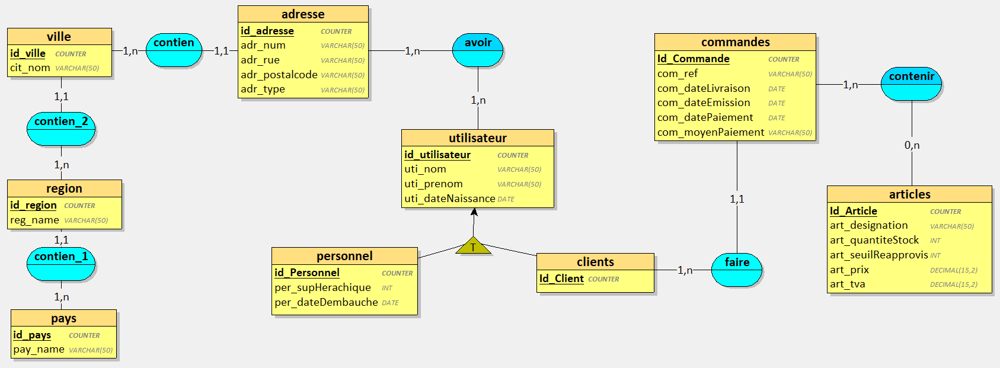
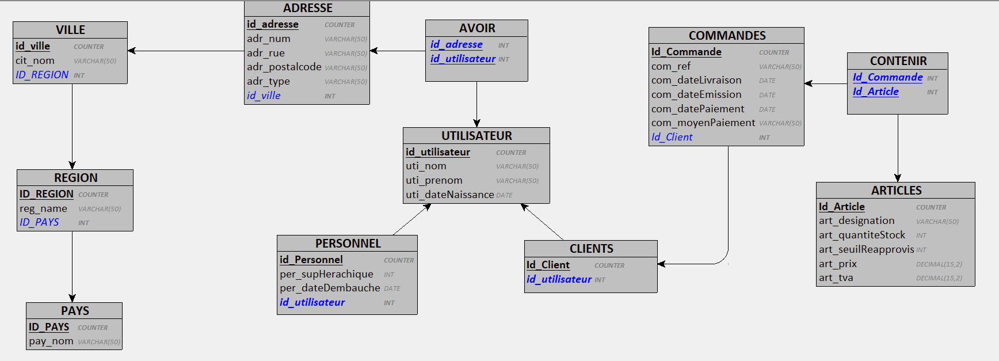
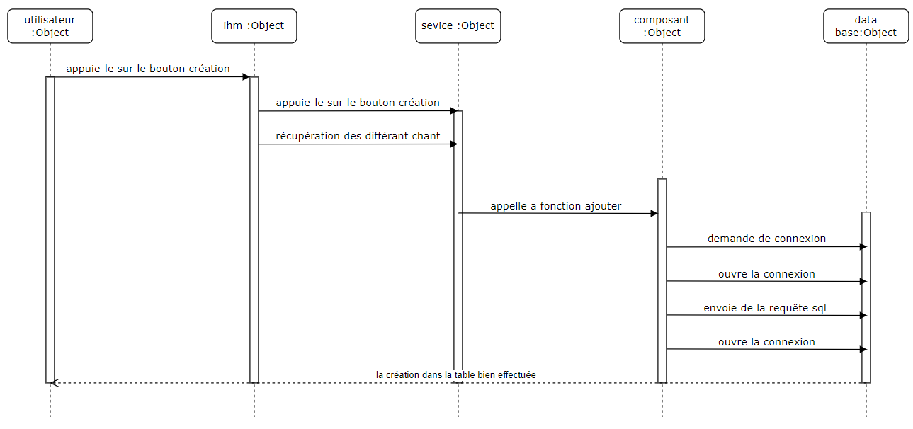

# 
 MININF-PROJET-POO 

## objectif de réalisation : 

définition et création de la base de données : 
    mcd 
    mld
    Dictionnaires des données

définition des actions pour interagir avec la base de données 
    diagramme uml : séquence (créer, modifier, supprimer, afficher des données)
    diagramme uml : activité
    diagramme uml : classe 

## directive fournie : 

## définition et création de la base de données : 

### mcd 

### mld

### Dictionnaires des données

[voir excel (POO dictionnaire de données)](POO_dictionnaire_de_données.xlsx)

### écriture du code permettant la création de la base de données (mpd)

[voir bdd.sql](bdd.sql)

## définition des actions pour interagir avec la base de données :

### diagramme de séquence pour la création d'une ligne dans une table :

